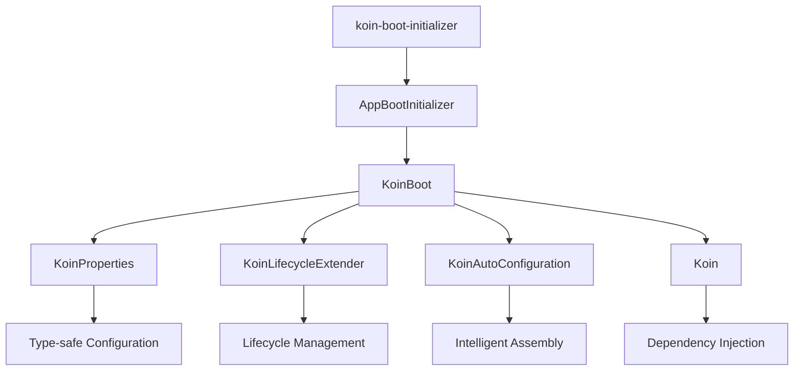

# KoinBoot

[简体中文](README_ZH.md) | [English](README.md) 

> An application framework based on Koin, focusing on solving configuration management, lifecycle and module assembly
> problems in enterprise development

## 🚀 Why Choose KoinBoot?

### From "Manual Transmission" to "Automatic Transmission" Development Experience

Koin is an excellent dependency injection framework, but in actual enterprise development, we found it's more like a
powerful "engine" rather than a "car" that can be used directly. KoinBoot was born to solve this problem.

| Traditional Koin Development                  | KoinBoot Development             |
|-----------------------------------------------|----------------------------------|
| Manual startup sequence management            | Declarative lifecycle management |
| Hardcoded configurations scattered everywhere | Intelligent configuration system |
| Module conflicts difficult to handle          | Automatic assembly mechanism     |
| Manual module addition/removal                | Plug-and-play                    |

### 🎯 Core Features

#### 1. **Intelligent Configuration System** - Say Goodbye to Hard Coding

```kotlin
// ❌ Traditional approach: configurations scattered across modules, difficult to manage uniformly
val networkModule = module {
  single<HttpClient> {
    HttpClient {
      install(HttpTimeout) {
        requestTimeoutMillis = 10_000  // Scattered configuration
      }
    }
  }
}

val logModule = module {
  single<Logger> {
    Logger.withTag("APP").apply {
      setMinSeverity(Severity.Info)  // Another scattered configuration
    }
  }
}

// ✅ KoinBoot approach: unified configuration management, configure as needed
runKoinBoot {
  properties {
    // Unified configuration entry point with intelligent hints
    ktor_client_timeout_request = 30000L
    ktor_client_logging_enabled = true
    kermit_severity = Severity.Verbose

    // These configuration items only appear when corresponding modules are introduced
    // Configuration items automatically disappear when module dependencies are removed
  }

  // All modules automatically initialize and inject based on a unified configuration
  AppBootInitializer()
}
```

#### 2. **Lifecycle Management** - Say Goodbye to Startup Chaos

```kotlin
// ❌ Traditional approach: chaotic startup logic
fun main() {
    Sentry.init { /* ... */ }           // Manual sequence management
    val koin = startKoin { /* ... */ }   // Chaotic startup logic
    backgroundService.start()            // Error-prone
}

// ✅ KoinBoot approach: declarative lifecycle
class SentryExtender : KoinLifecycleExtender {
    override fun doConfiguring(context: KoinBootContext) {
        // Automatically initialize at the right time
        Sentry.init { dsn = context.properties.sentry_dsn }
    }
}
```

#### 3. **Auto-Assembly** - Say Goodbye to Module Conflicts

```kotlin
// ❌ Traditional approach: module conflicts, which one takes effect?
val frameworkModule = module {
    single<HttpClient> { defaultHttpClient }
}
val businessModule = module {
    single<HttpClient> { customHttpClient }  // Conflict!
}

// ✅ KoinBoot approach: intelligent yielding
val KtorAutoConfiguration = koinAutoConfiguration {
    module {
        // Only use default configuration when user hasn't customized
        onMissInstances<HttpClient> {
            single<HttpClient> { defaultHttpClient }
        }
    }
}
```

#### 4. **Plug-and-Play** - Dependencies Determine Features

```kotlin
// build.gradle.kts - Just declare dependencies
val bootDependencies = listOf(
    projects.component.ktor,    // Add network functionality
    projects.component.kermit,  // Add logging functionality
// projects.component.sentry   // Remove this line to remove functionality
)

// main.kt - Automatically recognize and load
runKoinBoot {
    AppBootInitializer()  // Auto-generated, no manual management needed
}
```

## 🚀 Quick Start

### 1. Add Dependencies

```kotlin
plugins {
    kotlin("multiplatform")
    id("com.android.library")
    kotlin("plugin.serialization")
    `koin-boot-initializer`  // KoinBoot plugin
}

val bootDependencies = listOf<Dependency>(
    projects.component.ktor,        // HTTP client
    projects.component.kermit,      // Logging component
    projects.component.multiplatformSettings, // Configuration storage
    // Add other components as needed...
)

koinBootInitializer {
    includes(bootDependencies)  // Auto-recognize and generate initializer
}

dependencies {
    bootDependencies.forEach(::commonMainApi)
}
```

### 2. Start Application

```kotlin
fun main() {
    val koin = runKoinBoot {
        // Auto-generated unified entry point
        AppBootInitializer()

        // Intelligent configuration system
        properties {
            // Intelligent hints, type-safe
            kermit_severity = Severity.Verbose
            ktor_client_logging_enabled = true
            ktor_client_timeout_request = 30000L
        }

        // Optional: business customization
        module {
            // Will automatically override default configuration
            single<HttpClientEngine> { OkHttp.create() }
        }
    }

    // Use directly without worrying about initialization details
    runBlocking {
        val response = koin.get<HttpClient>().get("https://ktor.io/docs/")
        println("Status: ${response.status}")
    }
}
```

## 🎨 Real-World Use Cases

### Dynamic Configuration Management System

Imagine a scenario: your application needs to support operations staff dynamically adjusting configurations in the
backend, such as feature toggles, API timeout settings, etc., with real-time effectiveness.

```kotlin
// Remote configuration extender
class RemoteConfigExtender : KoinLifecycleExtender {
    override fun doConfiguring(context: KoinBootContext) {
        // Pull configuration from remote server
        val remoteConfig = fetchRemoteConfig()
        context.properties.putAll(remoteConfig)

        // Listen for configuration changes
        startConfigWatcher { newConfig ->
            // Update configurations in real-time when changed
            context.properties.putAll(newConfig)
            reconfigureComponents(context)
        }
    }
}

// Usage
runKoinBoot {
    AppBootInitializer()
    extenders(RemoteConfigExtender())
}
```

**Implementation Effects**:

- ✅ Dynamic configuration updates: Client automatically updates within seconds after operations staff modify
  configuration
- ✅ Gradual rollout support: Different user groups use different configurations
- ✅ Real-time fault recovery: Immediately turn off features through configuration switches when problems are detected
- ✅ A/B testing: Provide different configurations for different user groups

## 🏗️ Architecture Design

### Core Components



### Solution Overview

| Component                 | Problem Solved                        | Core Value                                 |
|---------------------------|---------------------------------------|--------------------------------------------|
| **KoinProperties**        | Configuration management difficulties | Type-safe intelligent configuration system |
| **KoinLifecycleExtender** | Chaotic startup sequence              | Declarative lifecycle management           |
| **KoinAutoConfiguration** | Module conflicts                      | Intelligent conditional assembly           |
| **koin-boot-initializer** | Manual module management              | True plug-and-play                         |

## 🌟 Business Value

- **Out-of-the-box**: Pre-built enterprise-grade components, fast startup for new projects, reducing wheel reinvention
- **Plugin-style development**: Modular architecture allows teams to develop in parallel, improving development
  efficiency
- **Reduced maintenance costs**: Unified technology stack and configuration approach, reducing learning costs and
  maintenance burden
- **Technical debt control**: Standardized architecture patterns, avoiding technical selection disagreements between
  projects
- **Rapid iteration**: Plug-and-play features make adding and removing functionality simple and efficient

## 📚 More Resources

- [📖 Detailed Introduction](docs/introduce.md) - Deep dive into design philosophy
- [🚀 User Guide](docs/guide.md) - Complete usage tutorial
- [💡 Best Practices](docs/best-practices.md) - Enterprise application cases

## 🤝 Contributing

Welcome to submit Issues and Pull Requests!

## 📄 License

MIT License