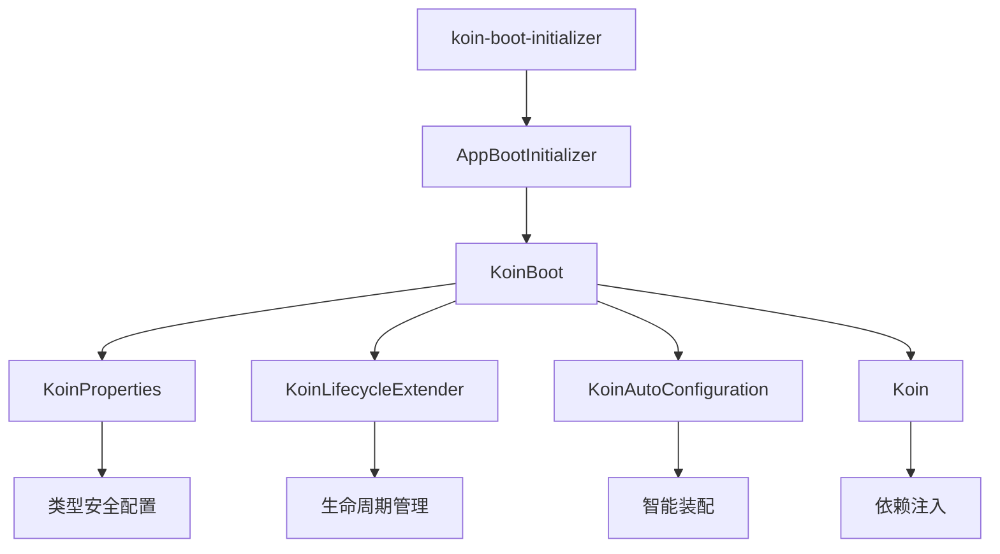

# KoinBoot

[简体中文](README_ZH.md) | [English](README.md)

> 基于 Koin 的应用框架，专注解决企业级开发中的配置管理、生命周期和模块装配问题

## 🚀 为什么选择 KoinBoot？

### 从"手动挡"到"自动挡"的开发体验

Koin 是一个优秀的依赖注入框架，但在实际企业级开发中，我们发现它更像是一个强大的"引擎"，而不是一辆可以直接使用的"汽车"
。KoinBoot 就是为了解决这个问题而生的。

| 传统 Koin 开发 | KoinBoot 开发 |
|------------|-------------|
| 手动管理启动顺序   | 声明式生命周期管理   |
| 硬编码配置散落各处  | 智能配置系统      |
| 模块冲突难以处理   | 自动装配机制      |
| 手动添加/删除模块  | 即插即用        |

### 🎯 核心特性

#### 1. **智能配置系统** - 告别硬编码

```kotlin
// ❌ 传统方式：配置散落，难以维护
val networkModule = module {
    single<HttpClient> {
        HttpClient {
            install(HttpTimeout) {
                requestTimeoutMillis = 10_000  // 硬编码，不够灵活
            }
        }
    }
}

// ✅ KoinBoot 方式：统一配置管理，按需配置
runKoinBoot {
    properties {
        // 统一配置入口，智能提示
        ktor_client_timeout_request = 30000L
        ktor_client_logging_enabled = true
        // set 时类型约束
        kermit_severity = Severity.Verbose

        // 只有引入对应模块时才有这些配置项
        // 移除模块依赖，配置项自动消失
    }
    // 所有模块自动根据统一配置进行初始化和注入
    AppBootInitializer()
}
```

#### 2. **生命周期管理** - 告别启动混乱

```kotlin
// ❌ 传统方式：启动逻辑混乱
fun main() {
    Sentry.init { /* ... */ }           // 手动管理顺序
    val koin = startKoin { /* ... */ }   // 启动逻辑混乱
    backgroundService.start()            // 容易出错
}

// ✅ KoinBoot 方式：声明式生命周期
class SentryExtender : KoinLifecycleExtender {
    override fun doConfiguring(context: KoinBootContext) {
        // 在正确的时机自动初始化
        Sentry.init { dsn = context.properties.sentry_dsn }
    }
}
```

#### 3. **自动装配** - 告别模块冲突

```kotlin
// ❌ 传统方式：模块冲突，哪个生效？
val frameworkModule = module {
    single<HttpClient> { defaultHttpClient }
}
val businessModule = module {
    single<HttpClient> { customHttpClient }  // 冲突！
}

// ✅ KoinBoot 方式：智能让位
val KtorAutoConfiguration = koinAutoConfiguration {
    module {
        // 只有当用户没有自定义时，才使用默认配置
        onMissInstances<HttpClient> {
            single<HttpClient> { defaultHttpClient }
        }
    }
}
```

#### 4. **即插即用** - 依赖决定功能

```kotlin
// build.gradle.kts - 只需声明依赖
val bootDependencies = listOf(
    projects.component.ktor,    // 添加网络功能
    projects.component.kermit,  // 添加日志功能
// projects.component.sentry   // 删除此行即移除功能
)

// main.kt - 自动识别并加载
runKoinBoot {
    AppBootInitializer()  // 自动生成，无需手动管理
}
```

## 🚀 快速开始

### 1. 添加依赖

```kotlin
plugins {
    kotlin("multiplatform")
    id("com.android.library")
    kotlin("plugin.serialization")
    `koin-boot-initializer`  // KoinBoot 插件
}

val bootDependencies = listOf<Dependency>(
    projects.component.ktor,        // HTTP客户端
    projects.component.kermit,      // 日志组件
    projects.component.multiplatformSettings, // 配置存储
    // 根据需要添加其他组件...
)

koinBootInitializer {
    includes(bootDependencies)  // 自动识别并生成初始化器
}

dependencies {
    bootDependencies.forEach(::commonMainApi)
}
```

### 2. 启动应用

```kotlin
fun main() {
    val koin = runKoinBoot {
        // 自动生成的统一入口
        AppBootInitializer()

        // 智能配置系统
        properties {
            // 智能提示，类型安全
            kermit_severity = Severity.Verbose
            ktor_client_logging_enabled = true
            ktor_client_timeout_request = 30000L
        }

        // 可选：业务定制
        module {
            // 会自动覆盖默认配置
            single<HttpClientEngine> { OkHttp.create() }
        }
    }

    // 直接使用，无需关心初始化细节
    runBlocking {
        val response = koin.get<HttpClient>().get("https://ktor.io/docs/")
        println("状态: ${response.status}")
    }
}
```

## 🎨 实际应用案例

### 动态配置管理系统

想象一个场景：你的应用需要支持运营人员在后台动态调整配置，比如功能开关、API 超时时间等，而且要实时生效。

```kotlin
// 远程配置扩展器
class RemoteConfigExtender : KoinLifecycleExtender {
    override fun doConfiguring(context: KoinBootContext) {
        // 从远程服务器拉取配置
        val remoteConfig = fetchRemoteConfig()
        context.properties.putAll(remoteConfig)

        // 监听配置变更
        startConfigWatcher { newConfig ->
            // 配置变更时实时更新
            context.properties.putAll(newConfig)
            reconfigureComponents(context)
        }
    }
}

// 使用
runKoinBoot {
    AppBootInitializer()
    extenders(RemoteConfigExtender())
}
```

**实现效果**：

- ✅ 动态配置更新：运营人员修改配置后，客户端几秒内自动更新
- ✅ 灰度发布支持：不同用户群体使用不同配置
- ✅ 实时故障恢复：发现问题立即通过配置开关关闭功能
- ✅ A/B 测试：为不同用户群体提供不同配置

## 🏗️ 架构设计

### 核心组件



### 解决方案总览

| 组件                        | 解决的问题  | 核心价值        |
|---------------------------|--------|-------------|
| **KoinProperties**        | 配置管理困难 | 类型安全的智能配置系统 |
| **KoinLifecycleExtender** | 启动顺序混乱 | 声明式生命周期管理   |
| **KoinAutoConfiguration** | 模块冲突   | 智能的条件装配     |
| **koin-boot-initializer** | 手动管理模块 | 真正的即插即用     |

## 🌟 商业价值

- **开箱即用**：预置企业级组件，新项目快速启动，减少重复造轮子
- **插件式开发**：模块化架构，团队可以并行开发，提高开发效率
- **降低维护成本**：统一的技术栈和配置方式，减少学习成本和维护负担
- **技术债务控制**：标准化的架构模式，避免项目间技术选型分歧
- **快速迭代**：即插即用的特性，让功能添加和移除变得简单高效

## 📚 更多资源

- [📖 详细介绍](docs/introduce_zh.md) - 深入了解设计理念
- [🚀 使用指南](docs/guide_zh.md) - 完整的使用教程
- [💡 最佳实践](docs/best-practices_zh.md) - 企业级应用案例

## 🤝 贡献

欢迎提交 Issue 和 Pull Request！

## 📄 许可证

MIT License

