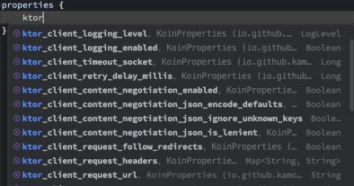
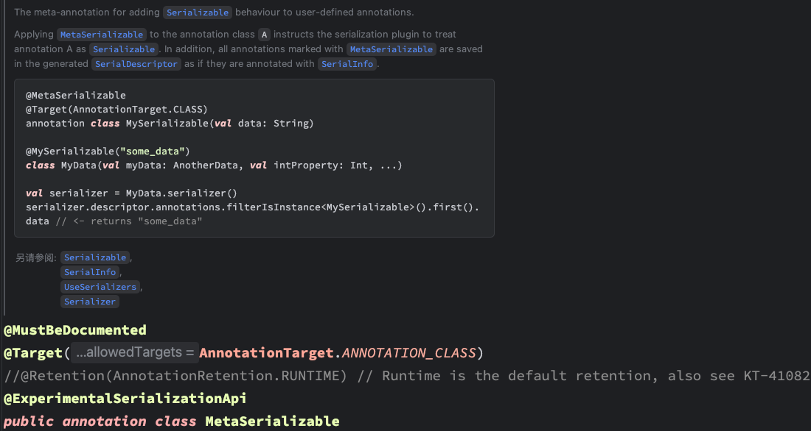

我来为你补充 Koin 源码介绍的部分，并整合到完整的文案中：

# KoinBoot：解决 Koin 实际使用中的痛点

> 一个基于 Koin 的应用框架，专注解决企业级开发中的配置管理、生命周期和模块装配问题

## 背景：从重复造轮子到统一架构

我叫卡莫，是一名 Kotlin 开发工程师。在我们公司的项目中，遇到了一个很常见的问题：每个新项目都要重新搭建相似的技术栈——网络层、日志、缓存等基础设施。不同项目用不同的技术选型，维护成本很高。

为了解决这个问题，我们决定停下手头的业务开发，专心打造一个统一的技术脚手架。选择 KMP 作为跨平台方案，用 Koin 来管理依赖注入。

我们的目标很简单：**让基础组件可以像搭积木一样灵活组装，开发者只需要按需选择，就能快速构建出稳定的应用**。

## 初识 Koin：优秀但有局限

### Koin 的核心工作原理

在深入问题之前，我先简单介绍一下 Koin 的工作原理。很多人可能觉得依赖注入很复杂，但 Koin 的设计理念很简单：

```kotlin
// Koin 的基本用法
val appModule = module {
    single { HttpClient() }
    single { UserRepository(get()) }
    factory { UserViewModel(get()) }
}

startKoin {
    modules(appModule)
}

// 使用时
val httpClient = koin.get<HttpClient>()
```


**Koin 的本质其实就是一个智能的 Map**：


```kotlin
inline fun indexKey(
    clazz: KClass<*>, typeQualifier: Qualifier?, scopeQualifier: Qualifier
): String {
    return buildString {
        append(clazz.getFullName())
        append(':')
        append(typeQualifier?.value ?: "")
        append(':')
        append(scopeQualifier)
    }
}
```

```
Type + Name + Scope = Key → Map<Key, InstanceFactory> → get<T>()
```

当你定义 `single<HttpClient>(named("client"))` 时，Koin 会：
1. 生成一个 Key（基于类型:`HttpClient`、名称: `"client"` 、作用域: 没有定义时默认为`__root__`）
2. 将这个 Key 和对应的实例工厂存入 Map
3. 调用 `get<HttpClient>(named("client"))` 时，用相同方式生成 Key 去 Map 中查找

### 为什么选择 Koin

1. **轻量级**：无反射，性能优秀
2. **纯粹性**：专注依赖注入，简单易懂
3. **Kotlin First**：语法友好，DSL 优雅
4. **跨平台**：完美支持 KMP

看起来很完美，但在实际使用中...

## 发现问题：Koin 的三个局限

深入使用 Koin 后，我们发现它作为依赖注入库很优秀，但距离我们的需求还有差距：

### 1. 配置管理困难

**问题场景**：脚手架提供了默认的网络模块，但不同项目需要不同的超时时间。

```kotlin
// 现状：只能修改源码来适应不同项目
val networkModule = module {
    single<HttpClient> {
        HttpClient {
            install(HttpTimeout) {
                // 硬编码配置，无法动态调整
                // A项目要10秒，B项目要15秒怎么办？
                requestTimeoutMillis = 10_000
                // or
                // set 的时候不知道放入的是什么类型: 类型不安全
                connectTimeoutMillis = getProperty("ktor.client.timeout.request")
            }
        }
    }
}
```

这种方式配置来源单一、无法动态调整、分散在各模块中难以维护,违反了开闭原则，每个项目都要修改框架代码，

### 2. 缺少生命周期管理

**问题场景**：应用启动需要严格的顺序控制，比如错误监控必须最先初始化。

> Sentry 必须在所有模块前初始化，后台服务要等一切准备就绪才启动。而 Koin 里只能在
`startKoin` 前后手动堆砌代码
```kotlin
// 现状：启动逻辑混乱，难以维护
fun main() {
    // 手动初始化各种服务
    Sentry.init { dsn = "..." }
    
    val koin = startKoin {
        modules(appModule)
    }
    
    // 手动启动后台服务
    backgroundService.start()
    
    // 项目复杂后，这里会变成难以维护的代码
}
```


### 3. 扩展能力有限

**问题场景**：无法实现智能的条件装配，容易产生模块冲突。

```kotlin
val frameworkModule = module {
    single<HttpClientEngine> { OkHttp.create() }
}

val businessModule = module {
    single<HttpClientEngine> { MockEngine.create() }
}

// 哪个会生效？只能通过加载顺序来决定
startKoin {
    modules(frameworkModule, businessModule)
}
```


**核心问题**：Koin 作为依赖注入库，无法满足真正的控制反转需求。它更像是一个优秀的"引擎"，而不是一辆可以直接使用的"汽车"。


## KoinBoot：从依赖注入到应用框架

### 从问题到解决方案的思路

当我们发现 Koin 作为依赖注入库无法满足真正的控制反转需求时，我们决定基于 Koin 构建一个更完整的解决方案。Koin 更像是一个优秀的"引擎"，而我们需要的是一辆可以直接使用的"汽车"。

**KoinBoot 的目标**：为 Koin 这个强大的依赖注入引擎，补充配置管理、生命周期控制、自动装配和模块导入功能，让它成为一个真正实用的应用框架。

接下来我们来看 KoinBoot 如何通过四个核心功能来解决这些问题：

## 解决方案一：配置管理系统 (KoinProperties)

### 为什么需要重新设计配置系统？

我们首先要解决的是配置管理问题。一个实用的脚手架，必须让开发者能够为不同环境、不同业务提供动态配置，而不是修改框架源码。

### 配置系统的设计过程

我们的配置系统经历了四个设计阶段：

**第一阶段：选择底层存储格式**

所有配置文件本质上都是键值对：
- `.properties` 文件：`key=value`
- `.yml/.json` 文件：层级结构的键值对

```kotlin
// 选择扁平化字符串格式，兼容各种配置来源
"ktor.client.timeout.request" = 5000L
```


我们选择扁平化字符串作为底层存储，这样可以兼容任何配置来源。

**第二阶段：提供 DSL 写法**

直接操作字符串对开发者不友好, 层级结构不明显。我们利用 Kotlin 的语言特性，重写 String 的 invoke 操作符，实现了类似 JSON 的 DSL 写法：

```kotlin
properties {
    "ktor" {
        "client" {
            "timeout" {
                "request"(30000L)
            }
        }
    }
}
```


框架会自动将这种嵌套结构转换为 `ktor.client.timeout.request=30000L` 的扁平格式。

**第三阶段：实现智能代码提示**

仅有 DSL 还不够，没有代码提示，而且基于字符串的操作符容易出错。

那竟然配置属性的字段key是固定的, 我们为何不把它作为`KoinProperties`的扩展属性呢。

```kotlin
// 模块化的配置属性
properties {
    // 引入 Ktor 模块时，自动获得这些配置提示
    ktor_client_timeout_request = 30000L
    // 类型安全
    ktor_client_logging_enabled = true

    // 引入 Kermit 模块时，自动获得这些配置提示
    kermit_severity = Severity.VERBOSE
}
```


这样，当你引入 Ktor 模块时，就会自动获得相关的配置提示；移除模块时，提示也会消失。

**第四阶段：类型安全的配置映射**

最后，我们需要方便地使用这些配置。如果每次都通过 key 去 map 中获取值，会产生很多模板代码。更好的方式是将配置映射为类型安全的对象：

```kotlin
// 通过注解和序列化，将配置映射为类型安全的对象
@KoinPropInstance("ktor.client")
data class KtorClientProperties(
    val timeout: Timeout = Timeout(),
    val logging: Logging = Logging()
)

@KoinPropInstance("ktor.client.timeout")
data class Timeout(
    val request: Long = 30000L,
    val connect: Long = 30000L,
    val socket: Long = 30000L,
)

// 使用时直接获取配置对象
val config = koin.get<KtorClientProperties>()
```



基于 Kotlin Serialization，使用 `@KoinPropInstance` 注解标注配置类，用 `preKey` 来指定序列化的层级起点。



```kotlin
@MetaSerializable
@Target(AnnotationTarget.CLASS)
annotation class KoinPropInstance(val preKey: String = "")
```

通过这四个阶段，我们实现了类型安全、有代码提示、写法简洁的配置方案。

```kotlin
// set
val properties = KoinProperties().apply {
    ktor_client_timeout_request = 1000
    ktor_client_logging_level = LogLevel.BODY
}
// get
val ktorClientProperties = properties.asPropInstance<KtorProperties>()!!
val timeout = properties.asPropInstance<KtorProperties.Timeout>()!!
val logging = properties.asPropInstance<KtorProperties.Logging>()!!
//  assert
assert(1000L == timeout.request && ktorClientProperties.client.timeout.request == timeout.request)
assert(LogLevel.BODY == logging.level && ktorClientProperties.client.logging.level == logging.level)
```

## 解决方案二：生命周期管理 (KoinLifecycleExtender)

### 从"何时配置"到"何时生效"

解决了配置"怎么配"的问题后，另一个重要问题出现了：**"何时配置？"以及"何时生效？"**

仅有配置还不够，如果不能在正确的时间点初始化和销毁组件——比如 Sentry 必须在所有业务模块启动前完成初始化来捕获全局异常——系统就会出现问题。

### 标准化的生命周期管理机制

我们引入了标准化的生命周期机制，类似于 Android 的 Activity Lifecycle：

```kotlin
enum class KoinPhase {
    Starting,
    Configuring,
    ModulesLoading,
    PropertiesLoading,
    Ready,
    Running,
    Stopping,
    Stopped
}

interface KoinLifecycleExtender {
    fun doStarting(context: KoinBootContext) {}
    fun doConfiguring(context: KoinBootContext) {}
    fun doModulesLoading(context: KoinBootContext) {}
    fun doPropertiesLoading(context: KoinBootContext) {}
    fun doReady(context: KoinBootContext) {}
    fun doStopping(context: KoinBootContext) {}
    fun doStopped(context: KoinBootContext) {}
}
```


具体实现示例：

```kotlin
class SentryExtender : KoinLifecycleExtender {
    override fun doConfiguring(context: KoinBootContext) {
        // 在配置阶段初始化 Sentry
        Sentry.init {
            // sentry_dsn 是 KoinProperties 的扩展属性
            dsn = context.properties.sentry_dsn
            // 配置其他选项...
        }
    }

    override fun doStopping(context: KoinBootContext) {
        // 在停止阶段关闭 Sentry
        Sentry.close()
    }
}
```

但是，谁来调 `KoinLifecycleExtender` 的这些方法？


### 生命周期的协调管理

我们需要一个管理层来协调这些生命周期扩展器：

```kotlin
class KoinBoot {
    // 管理生命周期
    // 调用扩展器
    // 最终启动 Koin
}

fun runKoinBoot(initializer: KoinBootInitializer): Koin = KoinBoot.run {
    // 1. 收集所有扩展器
    initializer(initializer)
    // ...
    // 2. 按生命周期顺序执行
    extenders.forEach { it.doConfiguring(context) }
    // ...
    extenders.forEach { it.doModulesLoading(context) }
    // ...
    extenders.forEach { it.doPropertiesLoading(context) }
    // ...
    // 3. 启动 Koin
    val koin = startKoin { /*...*/ }.koin
    // ...
    extenders.forEach { it.doReady(context) }
    // ...
    koin
}
```


使用时只需要声明式注册：

```kotlin
// 使用时声明式注册扩展器
runKoinBoot {
    extenders(SentryExtender())
    // 所有 Sentry 相关逻辑都封装在扩展器中
    // 主启动流程保持简洁
}
```


通过这种方式，KoinBoot 将原本混乱的过程式启动代码，变成了声明式的、可插拔的模块化生命周期管理。每个模块独立管理自己的生命周期，主启动流程保持简洁。

## 解决方案三：自动装配 (KoinAutoConfiguration)

### 从"强制提供"到"智能让位"

到此为止，我们既能灵活配置模块，又能精确控制启停时机。但在实践中我们发现了更深层次的需求：

**脚手架提供的默认模块（比如预置的 `HttpClient`），如果业务方想用自己的怎么办？**

按现有逻辑，我们还是会强行加载默认模块，可能导致冲突。脚手架应该是"服务者"，而不是"独裁者"。我们需要让模块自己判断是否应该加载。

### 借鉴自动配置的设计理念

我们设计了 `KoinAutoConfiguration` 接口，让模块变得"智能"：

```kotlin
interface KoinAutoConfiguration {

    /** 配置匹配条件: 如果为true则匹配成功会被调用 [configure] 方法 */
    fun KoinAutoConfigurationScope.match(): Boolean = true

    /** 配置作用域 */
    fun KoinAutoConfigurationScope.configure()

    /** 配置顺序，数字越小优先级越高  */
    val order: Int
        get() = Int.MAX_VALUE
}
```

1. **条件化判断**：检查环境决定是否生效
2. **顺序控制**：控制加载顺序

```kotlin
val KtorAutoConfiguration = koinAutoConfiguration {
    module {
        // 当不存在 HttpClientEngine 实例时，使用 OkHttp 引擎
        onMissInstances<HttpClientEngine> {
            single<HttpClientEngine> { OkHttp.create() }
        }
        single<HttpClient> { HttpClient(get<HttpClientEngine>()) }
    }
}

val userModule = module {
    single<HttpClientEngine> { MockEngine.create() }
}

runKoinBoot {
    autoConfigurations(KtorAutoConfiguration)
    modules(userModule)
    // 结果：使用 MockEngine，默认配置优雅让位
}
```


### 实现真正的控制反转

这种模式让我们的模块从**"我提供什么你就必须用什么"**变成了**"你需要时我提供最佳实践，你自定义时我优雅让位"**。

这样脚手架既能开箱即用，又具备高度灵活性。

## 解决方案四：自动导入 (koin-boot-initializer)

### 最后的障碍

到这里，我们已经打造出了功能完善的模块组件：可配置、有生命周期、还很智能。

但我们发现了一个问题：

- 开发者需要区分 `autoConfigurations` 和 `extenders`
- 需要了解每个模块的具体类型和用法
- 需要手动管理所有组件的调用方式

```kotlin
runKoinBoot {
    autoConfigurations(
        KtorAutoConfiguration,
        MultiplatformSettingsAutoConfiguration
    )
    extenders(KermitExtender(), SentryExtender())
    properties {
        // 业务配置...
    }
    modules(userModule)
}
```

这种手动操作，正是我们实现"即插即用"的最后障碍。

### 统一接口的尝试

我们尝试统一接口，让每个模块都提供一个 `BootInitializer`,业务侧开发者不需要关心是 `autoConfigurations` 还是
`extenders`：

```kotlin
runKoinBoot {
    KtorBootInitializer()
    KermitBootInitializer()
    MultiplatformSettingsBootInitializer()
    SentryBootInitializer()
    properties {
        // 业务配置...
    }
    modules(userModule)
}
```


但这样仍然存在问题：每当在 `build.gradle` 中添加新模块依赖时，都必须记得去启动文件里手动调用它的 `BootInitializer`。移除依赖时，又得记得删掉对应的代码。

### 让构建工具来帮忙

既然问题在依赖管理，为什么不让 Gradle 来解决？

我们开发了 `koin-boot-initializer` Gradle 插件：

```kotlin
// build.gradle.kts - 声明需要的模块
plugins {
    `koin-boot-initializer`
}

val bootDependencies = listOf(
    projects.component.ktor,    // 网络模块
    projects.component.kermit,  // 日志模块
    projects.component.sentry   // 监控模块
)

koinBootInitializer {
    includes(bootDependencies)
}

dependencies {
    bootDependencies.forEach(::commonMainApi)
}
```


### 自动生成统一入口

插件会自动识别依赖，找到所有 `BootInitializer`，然后生成统一的入口文件：

```kotlin
// 自动生成的 AppBootInitializer
val AppBootInitializer: KoinBootInitializer = {
    io.github.kamo030.KtorBootInitializer()
    io.github.kamo030.KermitBootInitializer()
    io.github.kamo030.MultiplatformSettingsBootInitializer()
}
```


使用时只需要：

```kotlin
runKoinBoot {
    // 自动生成的统一入口
    AppBootInitializer()

    properties {
        // 业务配置...
    }
    module {
        // 业务模块声明...
    }
}
```


有了这个插件，无论添加还是删除功能模块，我们都只需修改 `build.gradle.kts` 中的依赖声明，无需修改任何启动代码。这实现了真正的"即插即用"。

## 最终成果：完整的开发体验

### 四个解决方案的协作

让我们看看四个解决方案组合起来的开发体验：

### 第一步：声明需要的功能

```kotlin
// build.gradle.kts - 声明需要的组件
plugins {
    `koin-boot-initializer`
}

val bootDependencies = listOf(
    projects.component.ktor,    // 网络模块
    projects.component.kermit,  // 日志模块
    projects.component.sentry   // 监控模块
)

koinBootInitializer {
    includes(bootDependencies)
}

dependencies {
    bootDependencies.forEach(::commonMainApi)
}
```


### 第二步：配置想要的行为

```kotlin
// main.kt - 简洁的启动代码
fun main() {
    val koin = runKoinBoot {
        // 调用自动生成的初始化器
        AppBootInitializer()

        // 智能提示的配置
        properties {
            kermit_severity = Severity.Verbose
            ktor_client_logging_enabled = true
        }

        // 可选：业务定制
        // module {
        //    single<HttpClientEngine> { OkHttp.create() }
        // }
    }

    // 直接使用，无需关心初始化细节
    val httpClient = koin.get<HttpClient>()
    println("HttpClient is ready to use!")
}
```


### 第三步：享受自动化运行

当 `runKoinBoot` 执行时：

1. **生命周期管理**开始运转，Sentry 被优先初始化
2. **自动装配**开始扫描，发现没有自定义 `HttpClient`，于是加载默认的`HttpClient`
    1. 发现默认`HttpClient`需要`HttpClientEngine`，而业务侧开发者没有定义`HttpClientEngine`,于是加载默认的`HttpClientEngine`
    2. 通过上下文拿到配置的 `ktor_client_logging_enabled` 与默认的配置进行对`HttpClient`进行自动初始化
   ```kotlin
   val logging = koin.getPropInstance<KtorProperties.Logging>()
    // 日志配置
    if (logging.enabled) {
        install(Logging) {
            logger = get()
            level = logging.level
        }
    }
   ```
3. 所有模块准备就绪，应用启动

### 真正的"即插即用"

如果我们决定不再需要 Kermit 日志，只需要：

```kotlin
// build.gradle.kts
val bootDependencies = listOf(
    projects.component.ktor,
    // 删掉 Kermit 依赖
    // projects.component.kermit, 
    projects.component.sentry
)
```

1. 回到 `build.gradle.kts`，删掉 Kermit 依赖
2. 再次同步项目

这时 `main.kt` 中的 `kermit_severity` 会立刻报错，提示配置项不存在。

这就是真正的"即插即用"：**依赖决定功能，代码自动校验**。

## 总结

### 从"手动挡"到"自动挡"

通过 KoinBoot，我们成功地将一个纯粹的依赖注入"引擎"，升级成了自动化的、有生命周期的、可智能配置的应用框架。

### 实现的核心价值

- **从依赖注入到控制反转**：让框架更智能，开发者更专注业务
- **模块化开发**：添加依赖即获得功能，移除依赖即失去功能
- **开发体验提升**：告别繁琐的手动配置
- **真正的"即插即用"**：依赖决定功能，自动校验错误

**KoinBoot = Koin + 配置管理 + 生命周期 + 自动装配 + 自动导入**

最终，我们实现了构建高效、灵活、易维护的多平台脚手架的目标，让每个模块都成为可插拔的智能组件。构建更好的应用架构。


## 实际应用案例：动态配置管理系统

### 业务场景

假设我们正在开发一个企业级的移动应用，需要支持以下功能：
- 不同环境（开发、测试、生产）使用不同的服务器配置
- 运营人员可以在后台动态调整应用行为，如功能开关、API 超时时间等
- 支持灰度发布，不同用户群体使用不同的配置
- 配置变更需要实时生效，无需重启应用

### 基于 KoinBoot 的解决方案

#### 1. 配置远程拉取扩展器

```kotlin
class RemoteConfigExtender(
    private val configService: ConfigService,
    private val configWatcher: ConfigWatcher
): KoinLifecycleExtender {
    
    override fun doConfiguring(context: KoinBootContext) {
        // 在配置阶段，从远程服务器拉取最新配置
        val remoteConfig = fetchRemoteConfig()
        
        // 将远程配置合并到本地配置中
        context.properties.putAll(remoteConfig)
        
        // 启动配置监听服务
        startConfigWatcher(context)
    }
    
    private fun fetchRemoteConfig(): Map<String, Any> {
        // 调用配置服务 API
        return configService.getConfiguration(
            appVersion = BuildConfig.VERSION_NAME,
            userId = getCurrentUserId(),
            environment = getCurrentEnvironment()
        )
    }
    
    private fun startConfigWatcher(context: KoinBootContext) {
        // 使用 WebSocket 或长轮询监听配置变更
        configWatcher.onConfigChanged { newConfig ->
            // 配置变更时，更新 KoinProperties
            context.properties.putAll(newConfig)
            
            // 触发相关组件的重新配置
            notifyConfigChanged(context, newConfig)
        }
    }
}
```


#### 2. 热更新机制

```kotlin
class HotReloadExtender(
    private val configWatcher: ConfigWatcher
): KoinLifecycleExtender {
    
    override fun doReady(context: KoinBootContext) {
        // 应用就绪后，注册配置变更监听器
        configWatcher.onConfigChanged { changedKeys ->
            changedKeys.forEach { key ->
                when {
                    key.startsWith("ktor.client") -> {
                        // 重新配置网络客户端
                        reconfigureHttpClient(context)
                    }
                    key.startsWith("cache") -> {
                        // 重新配置缓存
                        reconfigureCache(context)
                    }
                    key.startsWith("feature_flags") -> {
                        // 更新功能开关
                        updateFeatureFlags(context)
                    }
                }
            }
        }
    }
    
    private fun reconfigureHttpClient(context: KoinBootContext) {
        val koin = context.koin
        val newConfig = koin.getPropInstance<KtorClientProperties>()
        
        // 重新创建 HttpClient 实例
        val newClient = HttpClient(koin.get<HttpClientEngine>()) {
            install(HttpTimeout) {
                requestTimeoutMillis = newConfig.timeout.request
                connectTimeoutMillis = newConfig.timeout.connect
            }
        }
        
        // 替换容器中的实例
        koin.declare(newClient, override = true)
    }
}
```


#### 3. 功能开关管理

```kotlin
@KoinPropInstance("feature_flags")
data class FeatureFlags(
    val newUserInterface: Boolean = false,
    val experimentalFeatures: Boolean = false,
    val premiumFeatures: Boolean = false
)

class FeatureFlagExtender : KoinLifecycleExtender {
    
    override fun doReady(context: KoinBootContext) {
        val featureFlags = context.koin.getPropInstance<FeatureFlags>()
        
        // 根据功能开关配置应用行为
        if (featureFlags.newUserInterface) {
            enableNewUI()
        }
        
        if (featureFlags.experimentalFeatures) {
            enableExperimentalFeatures()
        }
    }
}
```


#### 4. 完整的使用示例

```kotlin
fun main() {
    val koin = runKoinBoot {
        AppBootInitializer()
        
        // 注册动态配置扩展器
        extenders(
            RemoteConfigExtender(),
            HotReloadExtender(),
            FeatureFlagExtender()
        )
        
        // 本地默认配置（作为兜底）
        properties {
            ktor_client_timeout_request = 30000L
            feature_flags_newUserInterface = false
            cache_max_size = 1024
        }
    }
   
}
```


### 实现的效果

1. **动态配置更新**：运营人员在后台修改配置后，所有客户端会在几秒内自动更新，无需发版
2. **灰度发布支持**：不同用户群体可以使用不同的配置，实现渐进式功能推广
3. **实时故障恢复**：当发现新功能有问题时，可以立即通过配置开关关闭
4. **A/B 测试**：可以为不同用户群体提供不同的配置，进行效果对比

### 技术前景与扩展可能

#### 1. 云原生支持
```kotlin
// 与 Kubernetes ConfigMap 集成
class K8sConfigExtender(
    private val k8sClient: K8sClient
): KoinLifecycleExtender {
    override fun doConfiguring(context: KoinBootContext) {
        // 从 ConfigMap 加载配置
        val configMap = k8sClient.getConfigMap("app-config")
        context.properties.putAll(configMap.data)
    }
}
```


#### 2. 微服务配置中心
```kotlin
// 与 Spring Cloud Config、Nacos 等配置中心集成
class NacosConfigExtender(
    private val nacosClient: NacosClient
): KoinLifecycleExtender {
    override fun doConfiguring(context: KoinBootContext) {
        val nacosConfig = nacosClient.getConfiguration(
            dataId = "app-config",
            group = "DEFAULT_GROUP"
        )
        context.properties.putAll(nacosConfig)
    }
}
```


#### 3. 边缘计算场景
```kotlin
// 支持离线模式和边缘计算
class EdgeConfigExtender(
    private val localCache: ConfigCache
): KoinLifecycleExtender {
    override fun doConfiguring(context: KoinBootContext) {
        // 优先使用本地缓存，网络不可用时降级
        val config = localCache.getConfig() ?: fetchRemoteConfig()
        context.properties.putAll(config)
    }
}
```

### 发展前景

KoinBoot 作为一个应用框架，具有以下发展潜力：

1. **生态系统建设**：可以构建丰富的组件库，涵盖常见的企业级需求
2. **工具链完善**：开发配置管理后台、监控面板等配套工具
3. **跨平台扩展**：从 KMP 扩展到其他平台，形成统一的开发体验
4. **社区驱动**：建立开源社区，让更多开发者参与贡献

通过这种方式，KoinBoot 不仅仅是一个技术工具，更是一个能够支撑现代应用开发需求的完整解决方案。它让开发者能够专注于业务逻辑，而将配置管理、生命周期控制等基础设施交给框架来处理。


* [KotlinMultiplatform](https://kotlinlang.org/docs/multiplatform.html)
* [Koin](https://insert-koin.io/)