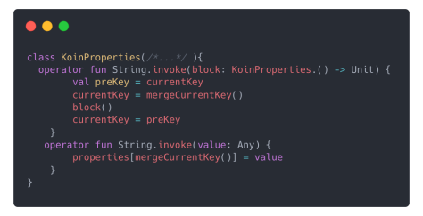
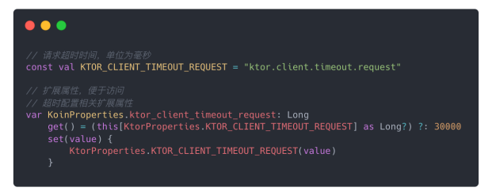
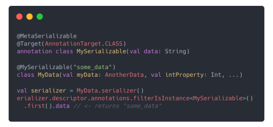
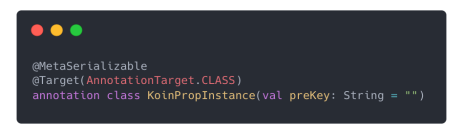
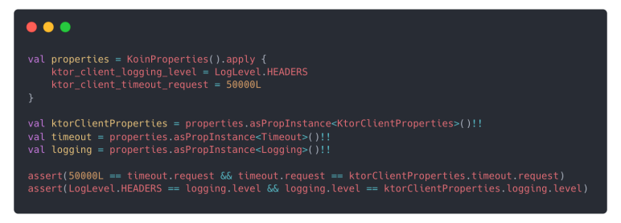
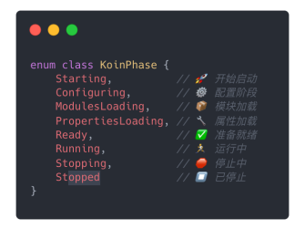
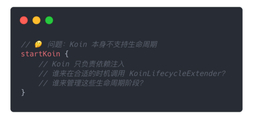
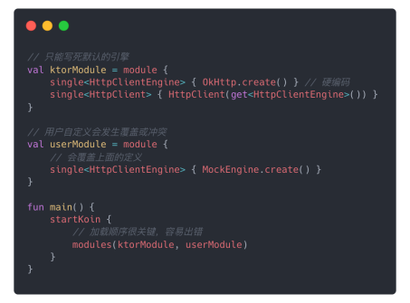
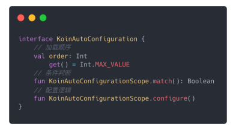

# 🚀 让 Koin 变成自动挡，一键启动！

> 从依赖注入到控制反转的完美进阶之路——[KoinBoot](https://github.com/KAMO030/koin-boot)

## 👋 背景故事：从痛点到转机

大家好，我是卡莫，一名热衷于 Kotlin 社区的 KMP 开发着。今天想和大家分享一个从"痛点"到"突破"的技术进化故事。

在我们公司的发展过程中，我们遇到了一个非常典型却令人头疼的问题：**随着业务快速发展，每个新项目都要重复搭建相似的技术架构**
——网络层、日志系统、缓存机制等等。更要命的是，不同项目使用不同技术栈，维护成本极高。

面对这种困境，我们做了一个相当大胆的决定：**暂停所有新业务研发，集中全力打造统一的技术脚手架**！

既然要统一技术栈，我们自然选择了 KMP 这个跨平台方案。我们的目标很明确：**打造一个像搭积木一样的开发体验**
——脚手架提供标准化的组件模块，业务开发者只需按需挑选、插拔，就能快速拼装出稳定可靠的应用。

为了管理这些组件模块间的依赖关系，我们选择了 Koin 这个轻量级的 DI 框架。然而，深入使用后我们发现：**Koin 有巨大潜力，但也有现实局限
**。今天分享的核心就是：**如何让 Koin 从依赖注入工具进化成真正的"自动挡"应用框架**。

## 🎯 初识 Koin：美好却不完整的开始

### Koin 的魅力所在

Koin 确实很优秀——它本质上是一个聪明的 `Map`，通过类型和名称作为 Key 存取实例，工作原理直观，上手快，学习成本低。


🔍 Koin 本质：智能的 Map

Type + Name + Scope = Key → Map<Key, InstanceFactory> → get\<T>()

🎯 选择 Koin 的理由:

1. 轻量级：无反射，性能优秀
2. 纯粹性：专注依赖注入，简单易懂
3. Kotlin First：语法友好，DSL 优雅
4. 跨平台：完美支持 KMP

💭 看起来完美，但实践中...

### 转折点：发现"半成品"的本质

但很快我们发现，**Koin 更像一个优秀的依赖注入"引擎"，而不是可以直接开上路的"汽车"**。对于我们要构建的灵活脚手架来说，它带来了三个绕不开的挑战：

## 💔 Koin 的三大痛点

### 1️⃣ 棘手的配置管理

**痛点描述**：想象一下，脚手架提供了默认网络模块，但 A 项目需要超时 10 秒，B 项目需要 15 秒。在纯 Koin 里，我们只能修改 Module
源代码，严重违反开闭原则！

```kotlin
// 痛点：每个项目都要修改源码来配置
val networkModule = module {
    single<HttpClient> {
        HttpClient {
            install(HttpTimeout) {
                // 硬编码配置，无法动态调整
                // A项目要10秒，B项目要15秒怎么办？
                requestTimeoutMillis = 10_000
                // or
                // set 的时候不知道放入的是什么类型: 类型不安全
                connectTimeoutMillis = getProperty("ktor.client.timeout.request")
            }
        }
    }
}
```

**问题本质**：配置来源单一、无法动态调整、分散在各模块中难以维护.

### 2️⃣ 缺失的生命周期管理

**痛点描述**：健壮的应用需要严格的启动顺序——Sentry 必须在所有模块前初始化，后台服务要等一切准备就绪才启动。Koin 里只能在
`startKoin` 前后手动堆砌代码。

```kotlin
// 痛点：启动逻辑混乱，顺序难以保证
fun main() {
    // 手动初始化 Sentry（必须在最前面）
    Sentry.init { dsn = "..." }

    val koin = startKoin {
        modules(appModule)
    }

    // 手动启动后台服务（必须在最后面）
    backgroundService.start()

    // 项目复杂后，这里会变成"祖传代码"...
}
```

**问题本质**：项目复杂后，启动类变成灾难现场，代码臃肿混乱，维护困难。

### 3️⃣ 贫乏的复用能力

**痛点描述**：希望脚手架能根据不同条件动态组装对象，但 Koin 缺乏扩展点，无法实现智能化的条件装配。

```kotlin
val ktorModule = module {
    // 不知道业务侧需要什么引擎只能写死
    single<HttpClientEngine> { OkHttp.create() }
    single<HttpClient> { HttpClientget<HttpClientEngine>() }
}

val userModule = module {
    // 业务侧想用模拟数据
    single<HttpClientEngine> { MockEngine.create() }
}

startKoin {
    // 只能通过顺序来控制覆盖 HttpClientEngine 的定义
    modules(ktorModule, userModule)
}
```

**问题本质**：无法方便的条件化注册实例,只能通过加载顺序处理冲突,到头来还是需要业务侧写大量模板代码。

## 🔧 KoinBoot：从"引擎"到"全功能开发车"

走到这里，我们明确了一个核心认知：**Koin 作为依赖注入库，无法满足真正的控制反转需求**。既然现有轮子不完全合手，那就自己造一个！

**KoinBoot 的使命**：为 Koin 这颗强大的"引擎"，装上"智能驾驶系统"、"豪华内饰"和"可插拔挂载点"，变成真正好开好用的"
全功能开发车"。

接下来，让我们看看 KoinBoot 如何通过四个核心解决方案，逐一攻克这些痛点：

## 🎨 解决方案一：智能配置管理 (`KoinProperties`)

### 为什么需要重新设计配置？

我们首先要攻克最棘手的**配置问题**。一个好的脚手架，必须让开发者能轻松为不同环境、不同业务提供动态、多来源的配置参数，而不是修改框架源码。

### 设计思路的演进过程

我们的配置系统经历了四个演进阶段：

**第一步：选择底层存储格式**

所有配置文件本质就是键值对

.properties → key=value

.yml/.json → 层级结构的键值对

```kotlin
// 回归本源：所有配置都是键值对
// 选择扁平化字符串，兼容任何配置来源
"ktor.client.timeout.request" = 5000L
```

**第二步：提供人性化的 DSL 写法**



利用语言特性重写String.invoke操作符,像写 JSON 一样优雅，自动打平存储

框架在底层会自动把它拍平变成: a.b.c=v


```kotlin
properties {
    "ktor" {
        "client" {
            "timeout" {
                "request"(30000L)
            }
        }
    }
}
```

**第三步：实现智能的代码提示**

光有 DSL 还不够，没有代码提示，而且是重写String的操作符很容易写错。

那竟然配置属性的字段key是固定的,我们为什么不可以把它作为`KoinProperties`的扩展属性呢。



当你引入 Ktor 模块，就会自动获得这些配置提示；移除模块，提示也就消失了。这才是真正的‘智能’。

```kotlin
// 配置属性作为扩展属性，模块化管理
properties {
    // 引入 Ktor 模块时，自动获得这些提示
    ktor_client_timeout_request = 30000L
    // 类型安全
    ktor_client_logging_enabled = true

    // 引入 Kermit 模块时，自动获得这些提示
    kermit_severity = Severity.VERBOSE
}
```


**第四步：类型安全的配置映射**

最后，我们要用这些配置的时候要怎么用才最方便呢?
肯定不是基于一个个的key去map里面get这样配置多起来了会出现很多模板代码
所以我们最好把这些配置映射通过成一个一个的配置类对象,通过对象的属性获取配置最符合直觉。

```kotlin
// 通过注解和序列化，将配置映射为类型安全的对象
@KoinPropInstance("ktor.client")
data class KtorClientProperties(
    val timeout: Timeout = Timeout(),
    val logging: Logging = Logging()
)

@KoinPropInstance("ktor.client.timeout")
data class Timeout(
    val request: Long = 30000L,
    val connect: Long = 30000L,
    val socket: Long = 30000L,
)

@KoinPropInstance("ktor.client.logging")
data class Logging(
    val enabled: Boolean = false,
    val level: LogLevel = LogLevel.INFO
)
```

基于Kotlin Serialization序列化使用`@KoinPropInstance( = "name1.name2")`注解标注配置类并使用preKey来标明序列化开始的层级。





通过这套组合拳，我们实现了**类型安全、有代码提示、写法优雅**的配置方案，彻底告别了配置管理的混乱。



## 🔄 解决方案二：生命周期管理 (`KoinLifecycleExtender`)

### 从"何时配"到"何时生效"

解决了配置"怎么配"的问题后，另一个更重要的问题浮出水面：**"何时配？"以及"何时生效？"**

光有配置还不够，如果不能在正确时间点初始化和销毁组件——比如 Sentry 必须在所有业务模块启动前完成初始化——那样才能捕获全局异常。
这就是我们必须攻克的第二个难关：**驯服混乱的启动流程**。

### 标准化的生命周期"钩子"机制

我们引入了一套标准化的生命周期机制，就像 Android 的 Activity Lifecycle：



```kotlin
interface KoinLifecycleExtender {
    fun doStarting(context: KoinBootContext) {}
    fun doConfiguring(context: KoinBootContext) {}
    fun doModulesLoading(context: KoinBootContext) {}
    fun doPropertiesLoading(context: KoinBootContext) {}
    fun doReady(context: KoinBootContext) {}
    fun doStopping(context: KoinBootContext) {}
    fun doStopped(context: KoinBootContext) {}
}

class SentryExtender : KoinLifecycleExtender {
    override fun doConfiguring(context: KoinBootContext) {
        // 在配置阶段初始化 Sentry
        Sentry.init {
            dsn = context.properties["sentry.dsn"]
        }
    }

    override fun doStopping(context: KoinBootContext) {
        // 在停止阶段关闭 Sentry
        Sentry.close()
    }
}
```

### "钩子"的操作者

但是，谁来调 `KoinLifecycleExtender` 的这些方法？



需要一个引导管理层来协调:

```kotlin
class KoinBoot {
    // 管理生命周期
    // 调用扩展器
    // 最终启动Koin
}
typealias KoinBootInitializer = KoinBootDSL.() -> Unit

fun runKoinBoot(
    initializer: KoinBootInitializer
): Koin = KoinBoot.run {
    // 1. 收集所有扩展器
    initializer(initializer)
    // ...
    // 2. 按生命周期顺序执行
    extenders.forEach { it.doConfiguring(context) }
    // ...
    extenders.forEach { it.doModulesLoading(context) }
    // ...
    extenders.forEach { it.doPropertiesLoading(context) }
    // ...
    // 3. 启动 Koin
    val koin = startKoin { /*...*/ }.koin
    extenders.forEach { it.doReady(context) }
    // ...
    koin
}
``` 

最后只需要声明式注册扩展器即可被应用:

```kotlin
// 使用时只需声明式注册
runKoinBoot {
    extenders(SentryExtender())
    // 所有 Sentry 相关逻辑都封装在扩展器中
    // 主启动流程保持干净整洁
}
```

通过这种方式，KoinBoot 将**原本混乱的过程式启动代码，变成了声明式的、可插拔的模块化生命周期管理**
。每个模块独立管理自己的生命周期，主启动流程保持简洁。

## 🤖 解决方案三：自动装配 (`KoinAutoConfiguration`)

### 从"独裁者"到"服务者"

至此，我们既能灵活配置模块，又能精确控制启停时机。看起来已经很强大了，但实践中我们发现了更深层次的需求：

**脚手架提供的默认模块（比如预置的 `HttpClient`），如果业务方想用自己的怎么办？**

按现有逻辑，我们还是会强行加载默认模块，可能导致冲突。**脚手架应该是谦逊的"服务者"，而不是霸道的"独裁者"**。我们需要一种"
礼让"的智慧，让模块自己判断是否应该加载。



### 借鉴 Spring Boot 的"自动配置"理念

我们设计了 `KoinAutoConfiguration` 接口，让模块变得"智能"：

1. **会"察言观色"**（条件化）：检查环境决定是否生效
2. **懂"先来后到"**（有序性）：控制加载顺序



```kotlin
val KtorAutoConfiguration = koinAutoConfiguration {
    module {
        // 当不存在HttpClientEngine实例的申明时，使用OkHttp引擎
        onMissInstances<HttpClientEngine> {
            single<HttpClientEngine> { OkHttp.create() }
        }
        single<HttpClient> { HttpClientget<HttpClientEngine>() }
    }
}

val userModule = module {
    single<HttpClientEngine> { MockEngine.create() }
}

runKoinBoot {
    autoConfigurations(KtorAutoConfiguration)
    modules(userModule)
}

```

### 实现真正的控制反转

这种模式让我们的模块从**"我提供什么你就必须用什么"**变成了**"你需要时我提供最佳实践，你自定义时我优雅让位"**。

这让脚手架既能**开箱即用**，又具备**极高灵活性**。

## 🎬 解决方案四：自动导入 (`koin-boot-initializer`)

### 最后一公里的障碍

到这里，我们已经打造出了近乎完美的模块组件：可配置、有生命周期、还很"聪明".

但发现了致命问题:

- 🤔 开发者需要区分 `autoConfigurations` 和    `extenders`
- 📚 需要了解每个模块的具体类型和用法
- 🔧 手动管理所有组件的调用方式

```kotlin
runKoinBoot {
    autoConfigurations(
        KtorAutoConfiguration,
        MultiplatformSettingsAutoConfiguration
    )
    extenders(KermitExtender(), SentryExtender())
    properties {
        // 业务测属性配置...
    }
    modules(userModule)
}
```

这种手动操作，正是我们实现"即插即用"梦想的最后障碍。我们必须消除它！

那么我们统一接口可以让每个模块都提供一个 `BootInitializer`, 应用开发者不需要关心是 `autoConfigurations` 还是
`extenders`, 实现真正的控制反转.

```kotlin
runKoinBoot {
    KtorBootInitializer()
    KermitBootInitializer()
    MultiplatformSettingsBootInitializer()
    SentryBootInitializer()
    properties {
        // 业务测属性配置...
    }
    modules(userModule)
}

```

每当我们在`build.gradle`中添加一个新模块的依赖，就必须记得去启动文件里手动调用它的 `BootInitializer`。
反之，移除依赖时，又得记得去删掉那行代码。这种手动操作，正是我们实现‘即插即用’梦想的‘最后一公里’。
我们必须消除它！于是，我们想也能不能自动帮我导入 `BootInitializer`呢?

### 让构建工具来帮忙

既然问题在依赖管理，为什么不让 Gradle 来解决？
于是最后一公里，我们交给了构建工具。`koin-boot-initializer` 就是我们开发的 **Gradle 插件**：

```kotlin
// build.gradle.kts - 声明需要的模块
plugins {
    `koin-boot-initializer`
}

val bootDependencies = listOf(
    projects.component.ktor,    // 网络模块
    projects.component.kermit,  // 日志模块
    projects.component.sentry   // 监控模块
)

koinBootInitializer {
    includes(bootDependencies)
}
```

### 自动生成统一入口

插件会自动扫描依赖，找到所有 `BootInitializer`，然后生成统一的入口文件：

```kotlin
plugins { `koin-boot-initializer` }

val bootDependencies = listOf<Dependency>(
    projects.component.ktor,
    projects.component.kermit,
    projects.component.multiplatformSettings,
    projects.component.sentry
)

koinBootInitializer {
    includes(bootDependencies)
}

dependencies {
    bootDependencies.forEach(::commonMainApi)
}

runKoinBoot {
    // 自动生成的统一入口	
    AppBootInitializer()
}

```

生成的 `AppBootInitializer` :

```kotlin
val AppBootInitializer: KoinBootInitializer = {
    io.github.kamo030.KtorBootInitializer()
    io.github.kamo030.KermitBootInitializer()
    io.github.kamo030.MultiplatformSettingsBootInitializer()
}
```

有了这个插件，无论添加还是删除功能模块，我们都只需修改 `build.gradle.kts` 中的依赖声明，无需触碰任何启动代码。这实现了*
*真正的"即插即用"**。

## 🎉 终极成果：积木式开发的完美体验

### 四个解法的完美协作

让我们看看把智能配置、生命周期、自动装配、自动导入四个解法组合起来，开发者的最终体验是什么样的：

### 步骤一：声明"我需要什么"

```kotlin
// build.gradle.kts - 像点菜一样声明需要的组件
val bootDependencies = listOf(
    projects.component.ktor,        // 我需要网络功能
    projects.component.kermit,      // 我需要日志功能
    projects.component.sentry       // 我需要监控功能
)

koinBootInitializer {
    includes(bootDependencies) // 告诉 KoinBoot 注入这些依赖
}
```

点击 Gradle 同步后，`koin-boot-initializer` 插件已经在后台自动生成了包含所有模块初始化逻辑的 `AppBootInitializer` 文件。*
*开发者甚至不需要知道这个文件的存在**。

### 步骤二：配置"我想要的样子"

```kotlin
// main.kt - 极简的启动代码
fun main() {
    val koin = runKoinBoot {
        // 调用自动生成的初始化器
        AppBootInitializer()

        // 智能提示的 DSL 配置
        properties {
            // 因为引入了 Kermit，这里会自动提示
            kermit_severity = Severity.Verbose
            // 因为引入了 Ktor，这里会自动提示
            ktor_client_logging_enabled = true
        }

        // 可选：业务定制
        // module {
        //    single<HttpClientEngine> { OkHttp.create() }
        // }
    }

    // 直接使用，无需关心初始化细节
    val httpClient = koin.get<HttpClient>()
    println("HttpClient is ready to use!")
}
```

**注意**：在 `properties` 代码块里，配置属性能被自动补全，正是因为我们在第一步中引入了对应的依赖！

### 步骤三：享受自动化运行

当 `runKoinBoot` 执行时，我们设计的一切都在水下完美协作：

1. **生命周期**开始运转，Sentry 被优先初始化
2. **自动配置**开始扫描，发现我们没有自定义 `HttpClient`，于是加载默认配置
3. 所有模块准备就绪，应用启动

### "即插即用"的终极体验

假设我们决定不再需要 Kermit 日志，开发者需要做什么？

**只需要**：回到 `build.gradle.kts`，删掉 Kermit 依赖，再次同步。

**神奇的事情发生了**：`main.kt` 中的 `kermit_severity` 会立刻标红报错，提示配置项不存在了。

这就是真正的"即插即用"：**依赖决定功能，代码自动校验**，将出错可能性降到最低。

## 🏆 核心价值与总结

### 从"手动挡"到"自动挡"的质变

通过 KoinBoot，我们成功地将：

- **一个纯粹的 DI "引擎"**
- **升级成了自动化的、有生命周期的、可智能配置的应用框架**

### 实现的核心价值

🎯 **从依赖注入到控制反转**：让框架更智能，开发者更专注业务

🧩 **积木式开发**：添加依赖 = 获得功能，移除依赖 = 失去功能

🔧 **开发体验升级**：彻底告别繁琐的手动配置

🚀 **真正的"即插即用"**：依赖决定功能，自动校验错误

---

**KoinBoot = Koin + 智能配置 + 生命周期 + 自动装配 + 自动导入**

最终，我们达成了构建**高效、灵活、易维护的多平台脚手架**的目标，让每个模块都成为可插拔的智能组件！

* [KotlinMultiplatform](https://kotlinlang.org/docs/multiplatform.html)
* [Koin](https://insert-koin.io/)